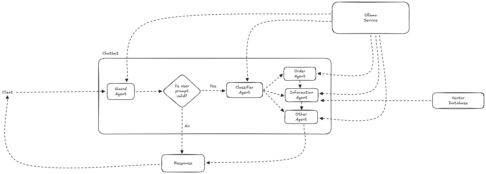

# Chatbot Exploration

This project explores the process of building a chatbot based on AI models and Retrieval-Augmented Generation (RAG) systems. The project leverages Docker for containerization, Ollama for managing large language models, `uv` for Python management, and Qdrant as a vector database.

> [!NOTE]
> This is a personal project intended for learning about AI, chatbots, and the technologies used around them. It is not designed for production use.

## Table of Contents
1. [Introduction](#introduction)
2. [Features](#features)
3. [Usage](#usage)
4. [Learning Objectives](#learning-objectives)
5. [Architecture](#architecture)
6. [License](#license)
7. [Acknowledgments](#acknowledgments)

## Introduction
This project explores how to create a chatbot utilizing AI models and RAG systems. The chatbot is designed to provide accurate and contextually relevant responses by combining the strengths of AI language models and efficient data retrieval mechanisms.

## Features
- **AI Models:** Utilizes advanced language models to generate human-like responses.
- **RAG Systems:** Implements Retrieval-Augmented Generation for enhanced accuracy and relevance.
- **Docker:** Uses Docker for easy deployment and management.
- **Ollama:** Manages large language models efficiently.
- **uv:** Handles Python environment management and dependencies.
- **Qdrant:** Utilizes Qdrant as a vector database for efficient data retrieval.

## Learning Objectives
The primary goal of this project is to provide hands-on experience in the following areas:
- Understanding how to work with large language models (LLMs).
- Learning about Retrieval-Augmented Generation (RAG) systems and their applications.
- Gaining familiarity with Docker for containerization and deployment.
- Using Ollama for managing large language models.
- Managing Python environments with `uv`.
- Utilizing Qdrant as a vector database for efficient data retrieval.

## Architecture

The architecture of this chatbot exploration project integrates several key components to ensure efficient processing and accurate responses. Below is an overview of the main components and their interactions:

- **Client:** The frontend interface where users interact with the chatbot.
- **Guard Agent:** Determines if the user prompt is valid.
- **Classifier Agent:** Classifies the user prompt to execute the Order Agent or the Information/Details Agent.
- **Order Agent & Information/Details Agent:** Use the large language model served through the Ollama API.
- **Vector Database (Qdrant):** The Details Agent utilizes this database to retrieve relevant information.

### Diagram

## License
This project is licensed under the MIT License. See the `LICENSE` file for more details.

## Acknowledgments
Special thanks to the YouTube channel **Code in a Jiffy** for his informative [video](https://www.youtube.com/watch?v=KyQKTJhSIak) that helped me understand a lot of the concepts used in this project.